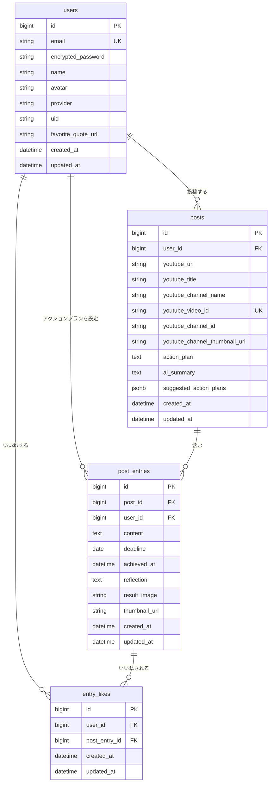

# mitadake?

> **「見て終わり」を「やってみる」に変える**
>
> 読み方：「みただけ？」

## 目次

- [サービス概要](#-サービス概要)
- [サービスURL](#-サービスurl)
- [開発背景](#-開発背景)
- [ユーザー層](#-ユーザー層)
- [使い方](#-使い方)
- [機能紹介](#-機能紹介)
- [技術構成](#-技術構成)
- [ER図](#-er図)

---

## ■ サービス概要

YouTube動画から得た学びを具体的な「アクションプラン」に変換し、実践を支援する行動変革アプリです。

動画を見て「これやってみたい！」と思った瞬間の熱量を逃さず、すぐに行動計画に落とし込めます。単なる動画ブックマークではなく、「見て終わり」から「やってみる」への変革を実現します。

## ■ サービスURL

https://mitadake.com/posts

## ■ 開発背景

YouTube動画で素晴らしい情報や学びに出会っても、「見て終わり」になってしまうことがほとんどです。

- 「この習慣、真似したい！」と思っても、動画を閉じた瞬間に忘れてしまう
- 何を見たか、何を学んだかが記憶から薄れていく
- 動画の学びを実践に移すタイミングを逃してしまう

この「感動した瞬間」と「実践するタイミング」の時間的ギャップを克服するために、動画を見たその場で具体的な「アクションプラン」を設定できる仕組みが必要だと考えました。

YouTube URLを入力するだけで動画情報が自動取得され、すぐにアクションプランを設定できる。このシンプルな体験により、動画からの学びを確実に実生活に反映できます。

## ■ ユーザー層

YouTube動画で学びを得ているが、「見て終わり」になりがちな人。

- 自己啓発・ビジネス系YouTubeをよく見る社会人
- 勉強系YouTubeで学習している学生
- フィットネス・料理などのHowTo動画を参考にしている人

理由：動画を見て「良い情報だ」と思っても実践に移せない課題を持つ人は多い。「URL入力→アクションプラン設定→完了」というシンプルな流れで、誰でも簡単に学びを行動に変換できます。

## ■ 使い方

### STEP 1: YouTube動画URLを入力

日常でYouTube動画を見て「これやってみたい！」と思った瞬間に、動画URLを入力。
サムネイル・タイトル・チャンネル名が自動取得されます。

### STEP 2: アクションプランを設定

動画から学んだことを具体的な行動に変換します。
YouTube風のタイトルで書くのがおすすめです。

- 例：「【再現】話題のレシピ作ってみた」
- 例：「【挑戦】1週間早起き生活やってみた」
- 例：「【レビュー】動画でおすすめされてた本を読んでみた」

https://i.gyazo.com/b4885a9c269c17c8ffe0a072668369c9.mp4

### STEP 3: 実践して達成記録

設定したアクションプランを実践し、達成ボタンで完了を記録。
1投稿1回のタスク型で、達成するとバッジ・アイコンで可視化されます。

## ■ サービスの差別化ポイント・推しポイント

### 推しポイント

- **YouTube特化**：URL入力だけでサムネイル・タイトル・チャンネル名を自動取得
- **達成記録の可視化**：感想と画像で達成の瞬間を記録・共有
- **動画と行動の紐付け**：いつでも元の動画に立ち返れる埋め込みプレイヤー表示

### 差別化ポイント

| 項目 | 本サービス | YouTube単体 | 習慣化アプリ |
|------|-----------|-------------|-------------|
| 動画の学び記録 | ◎ 自動取得 | × なし | × なし |
| 行動への変換 | ◎ アクションプラン | × なし | △ 行動のみ |
| 達成の可視化 | ◎ 画像・感想付き | × なし | ◎ あり |
| 動画との紐付け | ◎ 埋め込み表示 | - | × なし |

## ■ 機能紹介

### 完了済み ✅

- [x] ユーザー認証（Devise / Googleログイン）
- [x] 投稿CRUD（YouTube URL + アクションプラン）
- [x] YouTubeサムネイル・タイトル・チャンネル名自動取得
- [x] YouTube埋め込みプレイヤー表示
- [x] 達成記録（タスク型）
- [x] 達成バッジ・アイコン表示
- [x] いいね機能
- [x] オートコンプリート検索
- [x] ページネーション
- [x] マイページ・プロフィール画像
- [x] 利用規約・プライバシーポリシー
- [x] お問い合わせフォーム
- [x] OGP（静的）
- [x] 独自ドメイン設定
- [x] レスポンシブ対応
- [x] RSpec テスト
- [x] GitHub Actions CI

### 未完了 ⏳

- [ ] ファビコン

## ■ 技術構成

### 技術スタック

| カテゴリ | 技術構成 |
| --- | --- |
| フロントエンド | Ruby on Rails 7.2.2 / Hotwire (Turbo + Stimulus) / Tailwind CSS |
| バックエンド | Ruby 3.3.9 / Ruby on Rails 7.2.2 |
| データベース | PostgreSQL |
| 開発環境 | Docker |
| VCS | GitHub |
| CI/CD | GitHub Actions |
| インフラ | Render |

### 主要ライブラリ

| gem名 | 用途 |
| --- | --- |
| Devise | ユーザー認証機能 |
| OmniAuth | Googleログイン |
| Ransack | 検索機能 |
| Kaminari | ページネーション機能 |
| CarrierWave | 画像アップロード機能 |
| fog-aws / aws-sdk-s3 | S3ストレージ連携 |
| google-apis-youtube_v3 | YouTube Data API |
| meta-tags | OGP/SEO対応 |
| RSpec | テストフレームワーク |
| RuboCop | コード品質チェック |

## ■ ER図

